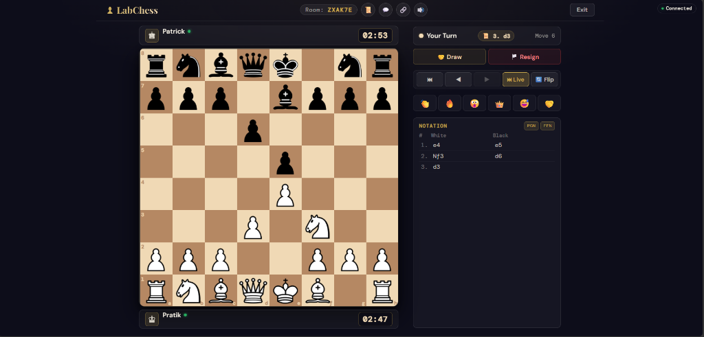
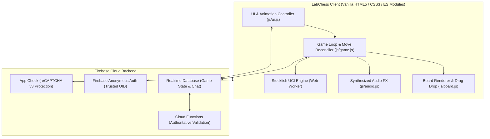

# ♟️ LabChess — Modern Real-Time Multiplayer & Stockfish Chess

<p align="center">
  
  
  
  
  
</p>

> **LabChess** is a zero-friction, production-ready chess web application featuring **real-time peer-to-peer multiplayer**, an integrated **Stockfish UCI chess engine**, **spectator mode**, **interactive move replays**, **in-game speech/thought bubbles**, and **customizable time controls** — completely playable in any browser with zero login required.

---

## 📸 Screenshots & Highlights

<p align="center">
  
</p>

---

## 🏛️ System Architecture



---

## 🌟 Key Features

### 1. ⚔️ Real-Time Multiplayer
- **Zero-Login Identity**: Firebase Anonymous Auth provides unique, trusted player sessions without email or password sign-ups.
- **6-Character Room Codes**: High-entropy codes excluding ambiguous characters (`0`, `O`, `1`, `I`).
- **One-Click Invitations**: Direct copy button for room links (`?room=XK92TF`).
- **Live Presence & Disconnect Handling**: Real-time connection monitoring (`.info/connected`) with automated session recovery on page reload.
- **Spectator Mode**: Infinite spectators per room with live viewer counts (`👁️`).
- **Game Lifecycle Management**: In-game draw offer agreements, resignations, timeout claims, and two-player rematch workflows.

### 2. 🤖 Stockfish UCI Chess Engine
- **Dedicated Web Worker**: Computes moves in background threads without blocking piece animations or UI.
- **Works 100% Offline**: Engine bundled locally in `js/vendor/` with zero third-party CDN latency.
- **3 Calibrated Skill Levels**:
  - 🟢 **Casual / Easy (~900 ELO)**: Fast, human-like play with deliberate minor inaccuracies.
  - 🟡 **Club Player (~1600 ELO)**: Sharp tactical play and positional piece-square evaluation.
  - 🔴 **Grandmaster / Master (~2500+ ELO)**: Deep search depth with full tactical evaluation.

### 3. ⏪ Step-by-Step Move Replay & History
- **Interactive Move Notation**: Standard SAN notation table tracking white and black moves.
- **Replay Navigation**: Step back through past positions with `⏮` (First), `◀` (Prev), `▶` (Next), and `⏭ Live`.
- **Notation Jumping**: Tap any historical move in the table to immediately preview that exact board state.

### 4. 💬 Live Chat & In-Game Speech/Thought Bubbles
- **In-Bar Speech Capsules**: Chat messages display right inside the opponent's bar (`[ ♚ ] alex: "Good luck!" [ 05:00 ]`) without overlapping the chessboard.
- **Thought Cloud Emojis**: Quick reactions (`👏`, `🔥`, `😮`, `👑`, `😅`, `🤝`) float gracefully above players.
- **Header Chat Notification**: Pulsing red unread indicator on the `💬` button when incoming messages arrive.

### 5. ⏱️ Synchronized Clocks & Audio FX
- **Customizable Time Controls**: Unlimited, 1 min (Bullet), 3 min (Blitz), 5 min (Blitz), and 10 min (Rapid).
- **Millisecond-Accurate Clocks**: Syncs remaining time across clients with automatic timeout detection.
- **Synthesized Web Audio**: Dynamic sound synthesis for moves, captures, checks, victories, and draw states.
- **Victory Confetti**: Celebratory particle confetti cannon on checkmate.

---

## 📁 Repository Structure

```
labchess/
├── index.html              # Single-page application entry point
├── config.js               # Firebase & App Check configuration
├── database.rules.json     # Hardened Firebase Realtime Database Security Rules
├── firebase.json           # Firebase CLI Hosting, CSP headers, & Functions config
├── .gitignore              # Clean repository ignore rules
├── css/
│   ├── board.css           # Chessboard styling, promotion modal, highlights
│   ├── ui.css              # Lobby, player bars, speech bubbles, chat drawer
│   └── responsive.css      # Fluid responsive breakpoints (320px mobile to 4K)
├── js/
│   ├── ai.js               # Stockfish UCI engine worker controller & fallback
│   ├── audio.js            # Web Audio API sound synthesizer
│   ├── board.js            # Chessboard.js setup, drag-and-drop, orientation
│   ├── confetti.js         # Particle celebration canvas animation
│   ├── firebase.js         # Firebase Auth, RTDB sync, presence, transactions
│   ├── game.js             # Core game state engine, clocks, replay navigation
│   ├── ui.js               # DOM event routing, speech bubbles, modals, chat
│   └── vendor/
│       └── stockfish.js    # Local Stockfish UCI engine bundle
├── functions/              # Optional authoritative Cloud Functions backend
│   ├── index.js            # Server-side move validation & room cleanup
│   └── package.json        # Cloud Functions dependencies
├── test/
│   ├── chess_rules.test.js # FIDE chess rules automated test suite (27 tests)
│   ├── security_rules.test.js # Schema & access control test suite (19 tests)
│   └── ai_engine.test.js   # Stockfish AI difficulty test suite (6 tests)
└── README.md
```

---

## 🗄️ Database Schema (`database.rules.json`)

```json
rooms/
  $roomId/
    metadata/
      hostUid: string            // Creator's Firebase Auth UID
      status: string             // "waiting" | "active" | "finished" | "expired"
      createdAt: number          // Server timestamp
      expiresAt: number          // TTL timestamp (2 hours)
      timeControl: number        // Time in seconds (0 = unlimited)
      drawOfferedBy: string|null // UID of player offering draw
      rematchRequestedBy: string // UID of player proposing rematch
    players/
      white: { uid, name, joinedAt, connected, lastSeen }
      black: { uid, name, joinedAt, connected, lastSeen }
    spectators/
      $spectatorUid: { name, joinedAt }
    chat/
      $msgId: { senderUid, sender, text (<= 200 chars), timestamp }
    reactions/
      $rxId: { senderUid, emoji (<= 16 chars), timestamp }
    game/
      fen: string                // Authoritative FEN string (<= 128 chars)
      turn: "w" | "b"            // Current turn indicator
      moveNumber: number         // Ply counter
      status: string             // "in_progress" | "checkmate" | "stalemate" | ...
      winner: "w" | "b" | "draw" // Game outcome
      clocks: { whiteTimeMs, blackTimeMs, lastMoveTime }
      lastMove: { from, to, san, piece, promotion }
    moves/
      $moveIndex: { playerUid, from, to, san, promotion, fenAfter, timestamp }
```

---

## 🛡️ Security Model & Hardening

| Area | Security Controls Implemented |
|---|---|
| **XSS Prevention** | 100% strict `textContent` and safe DOM node creation across all chat and notification rendering. |
| **Data Boundary Rules** | RTDB rules enforce strict length caps (`text <= 200`, `sender <= 32`), type validation, and `$other: { .validate: false }`. |
| **Seat Protection** | Atomic `runTransaction` locks prevent race conditions, seat hijacking, or third-player joins. |
| **Supply Chain Defense** | SHA-384 Subresource Integrity (`integrity`) hashes on all external CDN scripts. |
| **HTTP Security Headers** | Hardened `Content-Security-Policy` (CSP), `Permissions-Policy`, `X-Frame-Options: DENY`, `X-Content-Type-Options: nosniff`, and `HSTS` configured in `firebase.json`. |
| **Anti-Bot / Abuse** | Integrated Firebase App Check (reCAPTCHA v3) configuration. |

---

## 🧪 Automated Testing

LabChess features **52 automated unit and integration tests** across 3 dedicated test suites:

```bash
# Run FIDE Chess Rules Verification (27 tests)
node test/chess_rules.test.js

# Run Security Schema & State Machine Tests (19 tests)
node test/security_rules.test.js

# Run Stockfish AI Engine Tests (6 tests)
node test/ai_engine.test.js
```

### Test Coverage Highlights:
- ✅ Legal opening moves, check, checkmate, stalemate, three-fold repetition, insufficient material.
- ✅ En passant captures, castling (kingside/queenside), castling prevention during check, pawn promotions.
- ✅ High-entropy room code generation (1,000 unique room codes).
- ✅ Unauthenticated read/write blocks and state transition validations.
- ✅ Stockfish AI difficulty preset validations and tactical checkmate detection.

---

## 🚀 Quickstart & Local Development

### 1. Prerequisites
- [Node.js](https://nodejs.org/) (v18+)
- A [Firebase Project](https://console.firebase.google.com/) with **Anonymous Auth** and **Realtime Database** enabled.

### 2. Configure Firebase
Update `config.js` with your Firebase project credentials:
```javascript
const config = {
  firebase: {
    apiKey: "YOUR_API_KEY",
    authDomain: "YOUR_PROJECT.firebaseapp.com",
    databaseURL: "https://YOUR_PROJECT-default-rtdb.firebaseio.com",
    projectId: "YOUR_PROJECT",
    storageBucket: "YOUR_PROJECT.firebasestorage.app",
    messagingSenderId: "YOUR_SENDER_ID",
    appId: "YOUR_APP_ID"
  }
};

export default config;
```

### 3. Deploy Database Security Rules
```bash
firebase deploy --only database
```

### 4. Start Local Server
```bash
# Using Python
python -m http.server 8080

# Or using Node serve
npx serve .
```
Open **`http://localhost:8080`** in your browser. Open a second incognito window or share your local IP (`http://192.168.x.x:8080`) to play across devices!

---

## 🌐 Production Deployment

### Option A — Firebase Hosting (Recommended)
```bash
firebase deploy --only hosting,database
```

### Option B — Vercel
1. Push your repository to GitHub.
2. Import project in [Vercel](https://vercel.com).
3. Framework Preset: **Other** (Static HTML).
4. Click **Deploy**.

---

## 📜 License

Distributed under the **MIT License**. See `LICENSE` for more information.

---

<p align="center">
  Crafted with ❤️ for chess players worldwide ♟️
</p>